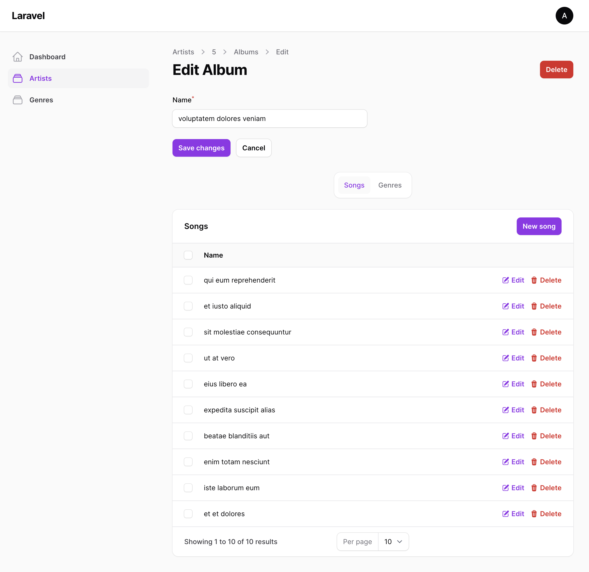
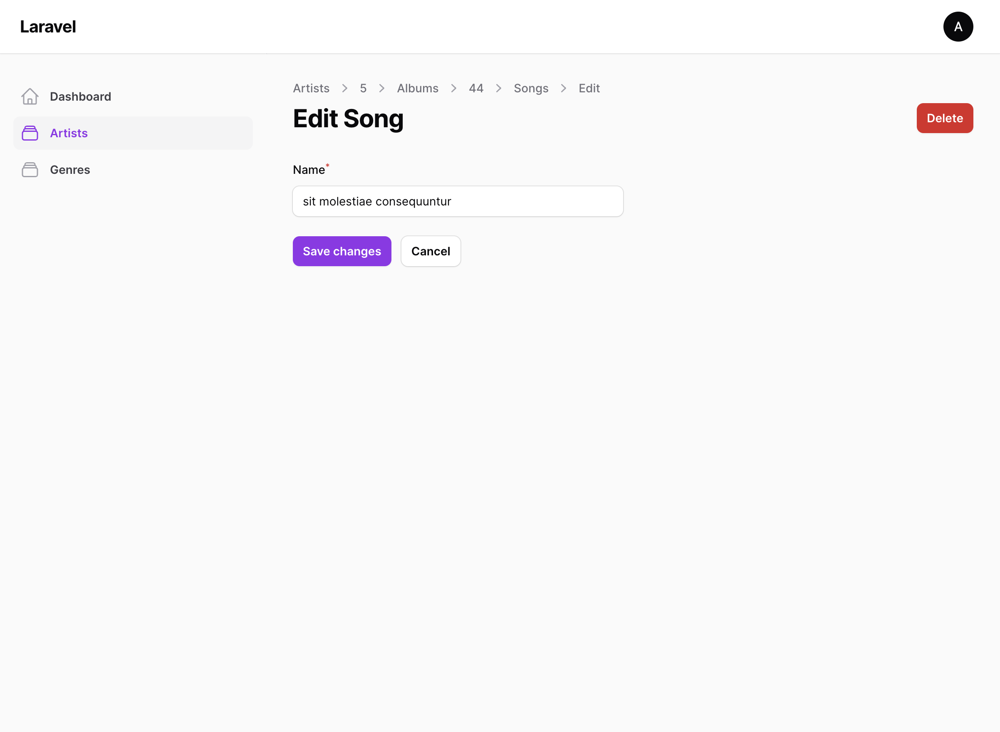

# Filament Nested Resources

[](https://packagist.org/packages/guava/filament-nested-resources)
[](https://packagist.org/packages/guava/filament-nested-resources)

Filament Nested Resources allows you to create nested resources of any depth. This is useful for resources which are too complex for relation manager, yet don't make sense as a standalone resource.

## Showcase




## Support us

Your support is key to the continual advancement of our plugin. We appreciate every user who has contributed to our journey so far.

While our plugin is available for all to use, if you are utilizing it for commercial purposes and believe it adds significant value to your business, we kindly ask you to consider supporting us through GitHub Sponsors. This sponsorship will assist us in continuous development and maintenance to keep our plugin robust and up-to-date. Any amount you contribute will greatly help towards reaching our goals. Join us in making this plugin even better and driving further innovation.

## Installation

You can install the package via composer:

```bash
composer require guava/filament-nested-resources
```

## Usage
Throughout the documentation I refer to `root` nested resource and `child` nested resources. The only difference is that the `Root` is the first resource in the relationship tree.

In the examples: ArtistResource > AlbumResource > SongResource

Artist would be the root resource, the other would be child resources.

### TL;DR
Replace all extends of `Resource`, `RelationManager`, `Page` classes with their corresponding `Nested` variants.  

So instead of extending `Resource`, extend `NestedResource`, instead of extending `EditRecord`, extend `NestedEditRecord` and so on.

Where applicable (in child resources), implement `getAncestor` to define the parent of the nested resource.

Optionally remove `index` page for child nested resources.

### Detailed usage

In order to make to set up Nested Resources, you need to do these steps:

1. Extend `NestedResource` on your root resource and all child resources you want to nest under your root resource.
2. On your child `NestedResources`, implement the `getAncestor()` method and return an instance of the `Ancestor` config.
3. On your **child** `NestedResource` pages, extend the corresponding `Nested[Context]Record`. So instead of `EditRecord`, extend `NestedEditRecord` and so on.
4. Create a `RelationManager` to bind the Resources together. Extend `NestedRelationManager` instead of `RelationManager`.

Let's imagine the scenario from the Showcase screenshots, where we have this schema:
1. Artist Model.
2. Album Model (Belongs to Artist).
3. Song Model (Belongs to Album).

First we create `ArtistResource`:

```php
use Guava\Filament\NestedResources\Resources\NestedResource;

class ArtistResource extends NestedResource
{
    //

    public static function getRelations(): array
    {
        return [
            AlbumsRelationManager::class,
        ];
    }
}
```

Next, we create the `AlbumResource`:

```php
use Guava\Filament\NestedResources\Resources\NestedResource;
use Guava\Filament\NestedResources\Ancestor;

class AlbumResource extends NestedResource
{
    //

    public static function getRelations(): array
    {
        return [
            // Repeat the same for Song Resource
        ];
    }
    
    public static function getAncestor() : ?Ancestor
    {
        // This is just a simple configuration with a few helper methods
        return Ancestor::make(
            ArtistResource::class, // Parent Resource Class
            // Optionally you can pass a relationship name, if it's non-standard. The plugin will try to guess it otherwise
        );
    }
}
```

For each page for our `AlbumResource`, we extend the corresponding NestedPage:

```php
use Guava\Filament\NestedResources\Pages\NestedCreateRecord;

class CreateAlbum extends NestedCreateRecord
{
    //
}
```

```php
use Guava\Filament\NestedResources\Pages\NestedEditRecord;

class EditAlbum extends NestedEditRecord
{
    //
}
```

```php
use Guava\Filament\NestedResources\Pages\NestedListRecords;

class ListAlbums extends NestedListRecords
{
    //
}
```

And finally we create the `AlbumsRelationManager`. We just need to extend the `NestedRelationManager` class here:

```php
use Guava\Filament\NestedResources\RelationManagers\NestedRelationManager;

class AlbumsRelationManager extends NestedRelationManager
{
    //
}
```

Optionally, we recommend deleting the `index` page from your child `NestedResources` (in this case AlbumResource):

```php
public static function getPages(): array
    {
        return [
            'create' => Pages\CreateAlbum::route('/create'),
            'edit' => Pages\EditAlbum::route('/{record}/edit'),
        ];
    }
```

The plugin will work either way, but the difference is that the breadcrumb URLs will redirect to different pages based on whether the index page exists or not.

If it exists, it will redirect to the index page (which might be a little confusing) and if it does NOT exist, it will redirect to the Parent Resource's Edit page. Since there's a relation manager, you will still have a list of all records.

## Contributing

Please see [CONTRIBUTING](./.github/CONTRIBUTING.md) for details.

## Security Vulnerabilities

Please review [our security policy](../../security/policy) on how to report security vulnerabilities.

## Credits

- [Lukas Frey](https://github.com/GuavaCZ)
- [All Contributors](../../contributors)

## License

The MIT License (MIT). Please see [License File](LICENSE.md) for more information.
