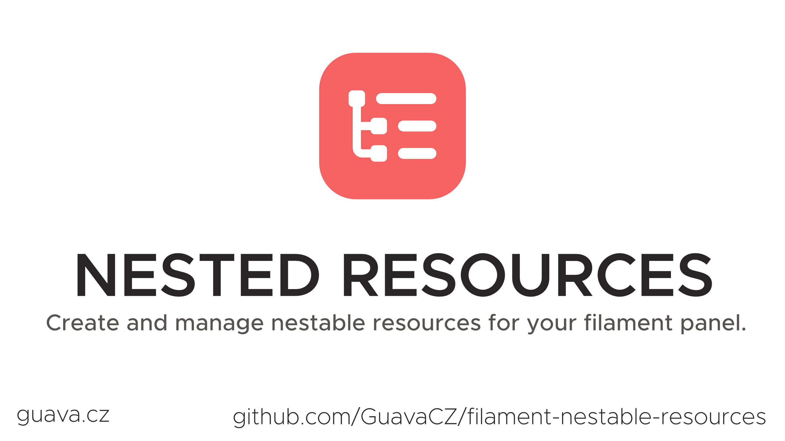

# Filament Nested Resources

[](https://packagist.org/packages/guava/filament-nested-resources)
[](https://packagist.org/packages/guava/filament-nested-resources)

Filament Nested Resources allows you to create nested resources of any depth. This is useful for resources which are too complex for relation manager, yet don't make sense as a standalone resource.

### Beta is here, with a much simpler and customizable implementation!
#### Warning: The beta and alpha versions are not compatible, as the beta is a complete rewrite of the package. Upgrading is easy though and described below.

## Showcase


## Support us

Your support is key to the continual advancement of our plugin. We appreciate every user who has contributed to our journey so far.

While our plugin is available for all to use, if you are utilizing it for commercial purposes and believe it adds significant value to your business, we kindly ask you to consider supporting us through GitHub Sponsors. This sponsorship will assist us in continuous development and maintenance to keep our plugin robust and up-to-date. Any amount you contribute will greatly help towards reaching our goals. Join us in making this plugin even better and driving further innovation.

## Installation

You can install the package via composer:

```bash
composer require guava/filament-nested-resources
```

## Usage
Throughout the documentation I refer to `root` nested resource and `child` nested resources. The only difference is that the `Root` is the first resource in the relationship tree.

In the examples: ArtistResource > AlbumResource > SongResource

Artist would be the root resource, the other would be child resources.

### Quick start

In order to set up Nested Resources, you need to do these steps:

1. On the resources (root and all child resources) you want to nest, add the `NestedResource` trait. You will be required to implement the `getAncestor` method. For the root resource, return `null`, for all child resources implement it according to the documentation below.
2. On every page of the resources from the 1st step, add the `NestedPage` trait.
3. Create a `RelationManager` ([Filament documentation](https://filamentphp.com/docs/3.x/panels/resources/relation-managers#creating-a-relation-manager)) or a `RelationPage` ([Filament documentation](https://filamentphp.com/docs/3.x/panels/resources/relation-managers#relation-pages)) to bind the Resources together. Add the `NestedRelationManager` trait to either of them.

Let's imagine the scenario from the Showcase screenshots, where we have this schema:
1. Artist Model.
2. Album Model (Belongs to Artist).
3. Song Model (Belongs to Album).

First we create `ArtistResource`:

```php
use Filament\Resources\Resource;
use Guava\FilamentNestedResources\Concerns\NestedResource;

class ArtistResource extends Resource
{
    use NestedResource;

    // If using Relation Manager:
    public static function getRelations(): array
    {
        return [
            AlbumsRelationManager::class,
        ];
    }
    
    public static function getPages(): array
    {
        return [
            'index' => Pages\ListArtists::route('/'),
            'create' => Pages\CreateArtist::route('/create'),
            'edit' => Pages\EditArtist::route('/{record}/edit'),
            'view' => Pages\ViewArtist::route('/{record}'),
            
            // In case of relation page.
            // Make sure the name corresponds to the name of your actual relationship on the model.
            'albums' => Pages\ManageArtistAlbums::route('/{record}/albums'),
            
            // Needed to create child records
            // The name should be '{relationshipName}.create':
            'albums.create' => Pages\CreateArtistAlbum::route('/{record}/albums/create'),
        ];
    }

    public static function getAncestor(): ?Ancestor
    {
        return null;
    }
}
```

Next, we create the `AlbumResource`:

```php
use Filament\Resources\Resource;
use Guava\FilamentNestedResources\Concerns\NestedResource;

class AlbumResource extends Resource
{
    use NestedResource;

    public static function getRelations(): array
    {
        return [
            // Repeat the same for Song Resource
        ];
    }
    
    public static function getAncestor() : ?Ancestor
    {
        // Configure the ancestor (parent) relationship here
        return Ancestor::make(
            ArtistResource::class, // Parent Resource Class
            'albums', // Relationship name
            'artist', // Inverse relationship name
        );
    }
}
```

In every page of our `ArtistResource` and `AlbumResource`, we add the `NestedPage` trait:

```php
use Filament\Resources\Pages\CreateRecord;
use Guava\FilamentNestedResources\Concerns\NestedPage;

class CreateArtist extends CreateRecord
{
    use NestedPage;

    //
}
```

```php
use Filament\Resources\Pages\EditRecord;
use Guava\FilamentNestedResources\Concerns\NestedPage;

class EditArtist extends EditRecord
{
    use NestedPage;
    
    //
}
```

```php
use Filament\Resources\Pages\ListRecords;
use Guava\FilamentNestedResources\Concerns\NestedPage;

class ListArtists extends ListRecords
{
    use NestedPage;

    //
}
```

Now let`s create a new page which will be used to create child records. Let's create `CreateArtistAlbum` page inside `ArtistResource/Pages`:

```php
use Guava\FilamentNestedResources\Pages\CreateRelatedRecord;
use Guava\FilamentNestedResources\Concerns\NestedPage;

class CreateArtistAlbum extends CreateRelatedRecord
{
    use NestedPage;

    //
}
```
Don\`t forget to register the page in the `getPages` method.

And finally we create either the `AlbumsRelationManager` or if you prefer to use a Relation Page then create a `ManageArtistAlbums` page. We just need to add the `NestedRelationManager` trait here.

For RelationManager:
```php
use Filament\Resources\RelationManagers\RelationManager;
use Guava\FilamentNestedResources\Concerns\NestedRelationManager;

class AlbumsRelationManager extends Relationmanager
{
    use NestedRelationManager;
    //
}
```

For RelationPage:
```php
use Filament\Resources\Pages\ManageRelatedRecords;
use Guava\FilamentNestedResources\Concerns\NestedPage;
use Guava\FilamentNestedResources\Concerns\NestedRelationManager;

class ManageArtistAlbums extends ManageRelatedRecords
{
    use NestedPage; // Since this is a standalone page, we also need this trait
    use NestedRelationManager;

    //
}
```

Optionally, we recommend deleting the `index` and `create` pages from your child `NestedResources` (in this case AlbumResource).

### Customizing the breadcrumbs
Every resource can control their own part of the breadcrumb, which by default consists of an `index` breadcrumb and a `detail` breadcrumb.

The `index` breadcrumb typically redirects to the index page.

The `detail` breadcrumb typically redirects to the detail (edit or view) and by default, will display the route key (ID if not configured otherwise) of the record. 

You can override the label via the `getBreadcrumbRecordLabel` method of a `NestedResource`:

```php
public static function getBreadcrumbRecordLabel(Model $record)
{
    return $record->first_name . ' ' . $record->last_name;
}
```

Or you can override the resource\`s breadcrumb part completely, by overriding the `getBreadcrumbs` method on the resource:

```php
public static function getBreadcrumbs(Model $record, string $operation): array
{
    return [
        'my-custom-url' => 'My custom label',
];
}
```

## Contributing

Please see [CONTRIBUTING](./.github/CONTRIBUTING.md) for details.

## Security Vulnerabilities

Please review [our security policy](../../security/policy) on how to report security vulnerabilities.

## Credits

- [Lukas Frey](https://github.com/GuavaCZ)
- [All Contributors](../../contributors)

## License

The MIT License (MIT). Please see [License File](LICENSE.md) for more information.
